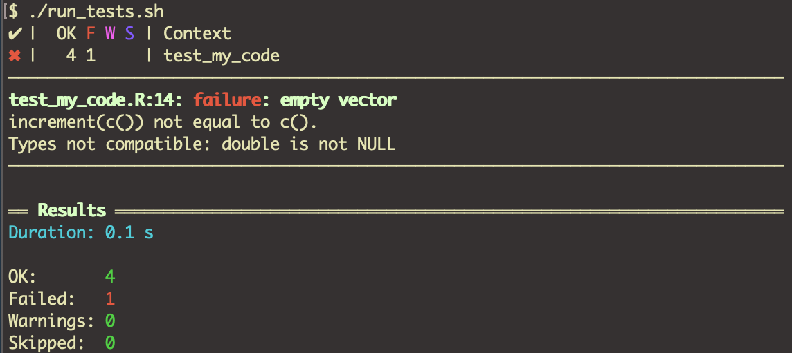

# Unit Testing

This is a basic example for using the [testthat](http://r-pkgs.had.co.nz/tests.html) R package **without** creating a package.

## Prerequisites

 R must be installed and `Rscript` should be in the search path.

## Installation

Change into this directory and call `install.sh` for installing the required package(s).

## Running the tests

Change into this directory and call `run_tests.sh` 

or

- open RStudio
- change your working directory to this directory
- call `testthat::test_dir('tests')`

## Hint

In this example on test fails for educational purpose.

My result looks like this

